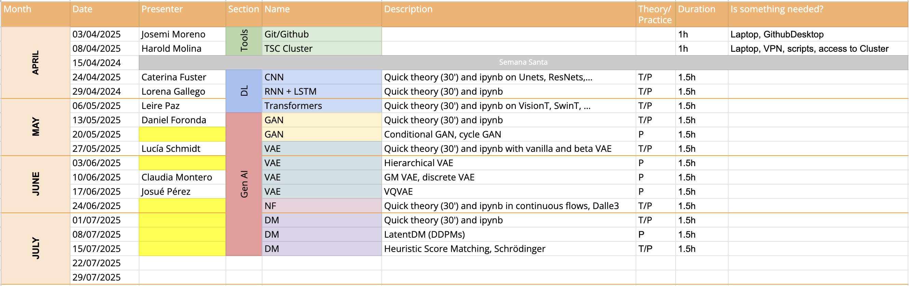

# Ágora

**Ágora** is a weekly scientific exchange activity organized by PhD students, postdocs, and faculty from the Signal Theory and Communications Department at Universidad Carlos III de Madrid.

In each session, we explore research topics, review scientific papers, and share hands-on knowledge in fields like Deep Learning and Generative AI.

This repository gathers materials presented during the sessions, including slides, notebooks, and code.

## Repository Structure

- `tools/` – Technical setup sessions (e.g., Git)
- `basics-dl/` – Introduction to Deep Learning (CNNs, RNNs, Transformers...)
- `genai/` – Generative AI topics (GANs, VAEs, Diffusion Models...)

## 🗓️ Schedule

Below is the current Ágora calendar for the April–July 2025 cycle:

## License Notice

All materials are provided for academic and educational use only.  
**Reuse, redistribution, or modification without permission is not allowed.**  
See [LICENSE](./LICENSE.md) for details.

---
